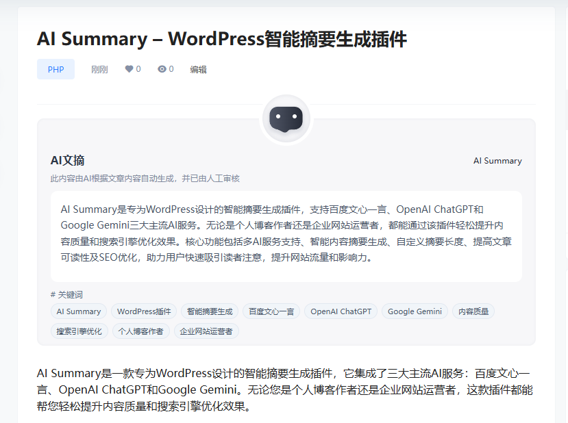
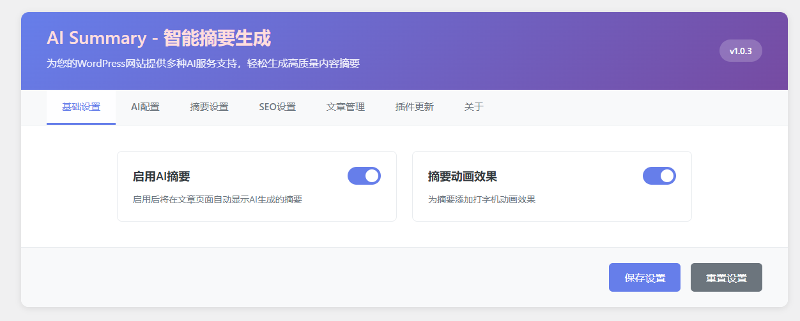
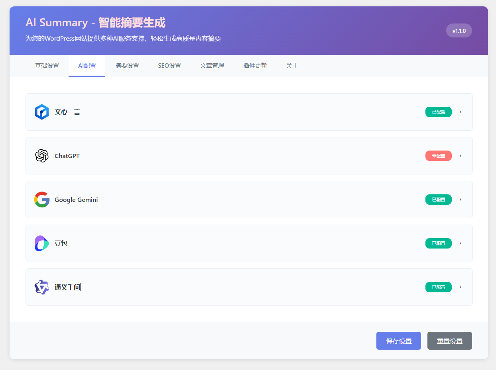
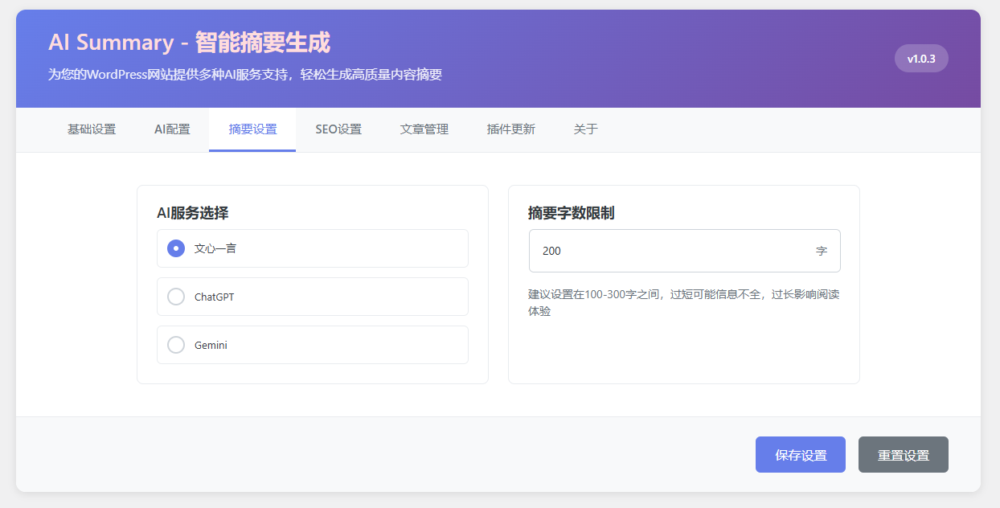
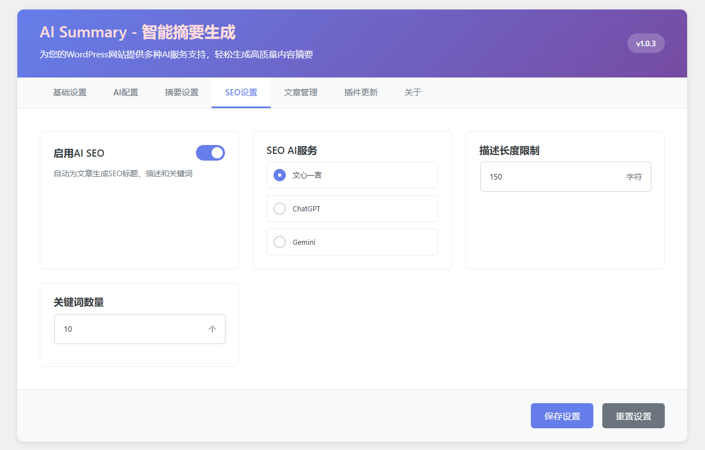
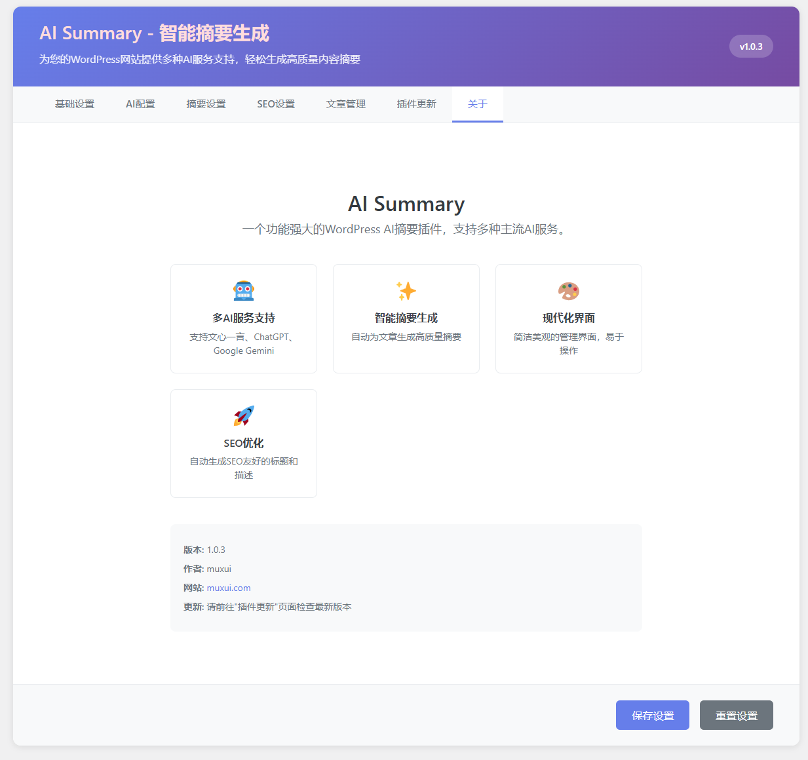
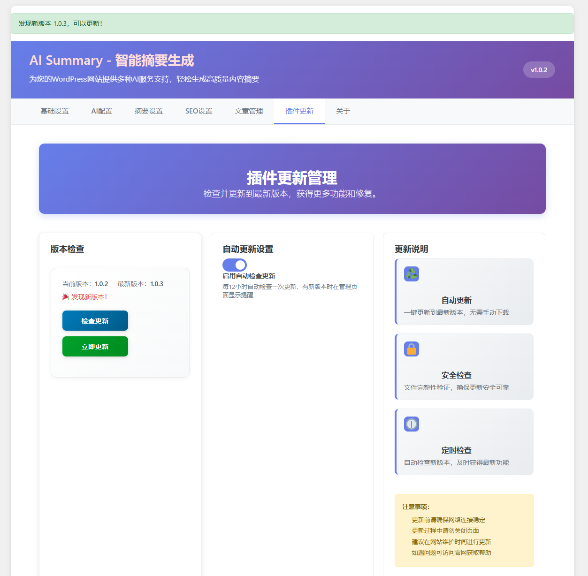
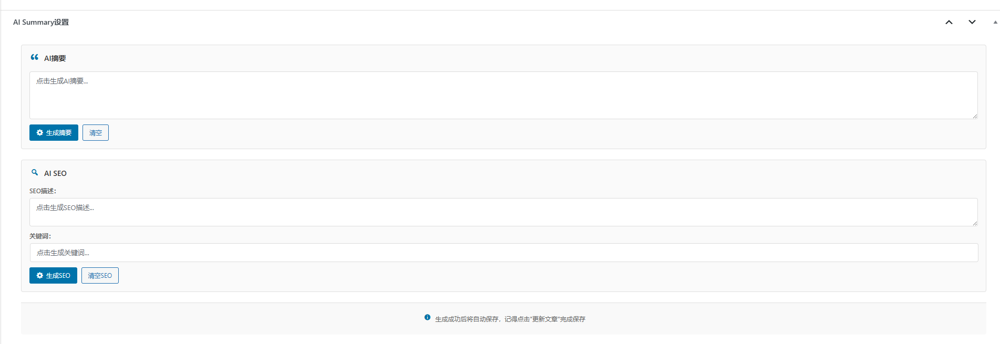

AI Summary是一款专为WordPress设计的智能摘要生成插件，它集成了五大主流AI服务：百度文心一言、OpenAI ChatGPT、Google Gemini、字节豆包和阿里通义千问。无论您是个人博客作者还是企业网站运营者，这款插件都能帮您轻松提升内容质量和搜索引擎优化效果。

## 🚀 核心功能特性

#### 多AI服务支持

🌟 ChatGPT - OpenAI官方API，支持自定义API地址和模型名称

✨ Google Gemini - 谷歌最新AI模型，支持自定义API地址和模型名称

🔥 文心一言 - 百度千帆大模型平台，支持最新API Key认证

🔥 字节豆包 - 火山方舟平台，支持自定义API地址和模型名称

⚡ 通义千问 - 阿里云百炼平台，支持多种模型规格

#### 智能内容生成

📝 AI摘要生成 - 自动提取文章核心内容，生成吸引人的摘要

🔍 SEO自动优化 - 智能生成SEO描述和关键词

🎯 内容精准提取 - 500字关键内容提取，降低API成本

#### 完美主题集成

🎨 B2主题完美适配 - 自动填充B2主题SEO字段

🔄 双向数据同步 - AI字段与主题字段实时同步

📱 响应式设计 - 支持所有WordPress编辑器

## 💡 使用方法

#### 编辑页面生成

在文章编辑页面右侧找到 "AI Summary设置" 元框：

生成摘要: 点击"生成摘要"按钮，AI自动分析文章内容

生成SEO: 点击"生成SEO"按钮，自动生成描述和关键词

自动保存: 生成成功后自动保存，无需手动操作

一键同步: 自动填充到B2主题SEO字段

#### 批量管理

在 AI Summary → 文章管理 页面：

✅ 批量生成摘要: 选择多篇文章，一键生成摘要

✅ 批量生成SEO: 智能跳过已生成的内容

✅ 状态监控: 清晰显示每篇文章的生成状态

✅ 进度反馈: 详细的操作进度和结果提示

## 🎨 前端展示效果

插件在文章页面自动添加精美的AI摘要展示区域：

🎭 打字机动画效果 - 吸引用户注意力

🎯 "看其他文章"按钮 - 增加页面停留时间

📱 响应式设计 - 完美适配移动端

🎨 可自定义样式 - 与网站主题完美融合

## 🎨 后端展示效果








## ⚡ 性能优化特性

#### 智能内容提取

🔹 关键内容识别: 自动提取标题、首段、关键段落

🔹 500字限制: 大幅降低API调用成本

🔹 提取算法: 智能识别文章核心信息

#### 数据缓存机制

🔹 生成结果缓存: 避免重复生成相同内容

🔹 本地数据存储: WordPress原生meta机制

🔹 增量更新: 只有内容变化时才重新生成

## 🛠️ 技术实现细节

#### 架构设计
```
// 统一AI调用接口
class AI {
    static function getSummary($content) {
       // 智能摘要生成
   }
   
   static function getSeo($content) {
        // SEO信息生成
    }
}
​
// 多AI服务适配
switch ($provider) {
   case 'wenxin': return WenXin::chat();
case 'chatgpt': return ChatGPT::chat();  
case 'gemini': return Gemini::chat();
case 'doubao': return Doubao::chat();
case 'tongyi': return Tongyi::chat();
}
```
## 📊 功能对比表

功能特性AI Summary其他插件多AI服务支持✅ 5个主流服务❌ 单一服务B2主题集成✅ 完美适配❌ 需手动配置智能内容提取✅ 500字优化❌ 全文发送实时双向同步✅ 自动同步❌ 单向导出批量处理✅ 智能跳过❌ 重复生成用户体验✅ 一键操作❌ 复杂配置

## 🎯 适用场景

#### 个人博客

📝 技术分享博客 - 自动生成技术要点摘要

📚 知识分享站点 - 提炼核心知识点

🎨 创作类网站 - 吸引读者阅读兴趣

#### 企业网站

🏢 公司新闻站 - 快速生成新闻摘要

📈 产品介绍页 - 突出产品核心卖点

🎓 在线教育 - 课程内容精华提取

#### 内容平台

📖 资讯聚合站 - 批量生成文章摘要

🌐 多语言网站 - 统一内容生成标准

📱 移动优先站 - 简洁摘要提升体验

## 🔧 高级配置技巧

自定义API配置

#### ChatGPT配置:

🔹 API地址 (可选): 支持第三方代理和镜像站

🔹 自定义模型: 支持最新模型如gpt-4o、gpt-4o-mini等

🔹 优先级: 自定义模型名称优先于下拉选择

#### Gemini配置:

🔹 API地址 (可选): 支持代理服务和第三方兼容接口

🔹 自定义模型: 支持最新模型如gemini-1.5-flash等

🔹 优先级: 自定义模型名称优先于下拉选择

#### API成本优化

选择合适模型:

日常使用: ernie-3.5-8k / gpt-3.5-turbo

高质量需求: ernie-4.0-8k / gpt-4

内容长度控制:

摘要字数: 100-200字 (平衡质量与成本)

SEO描述: 120-150字符 (搜索引擎友好)

批量处理策略:

选择性生成: 只为重要文章生成

定期更新: 根据流量数据优化

## 📈 SEO优化效果

使用AI Summary插件后，您的网站将获得：

#### 搜索引擎优化

🎯 精准关键词: AI智能识别文章核心关键词

📝 吸引人描述: 生成符合搜索引擎要求的描述

🔍 提升点击率: 优质摘要吸引更多用户点击

#### 用户体验提升

⚡ 快速了解: 用户可快速了解文章内容

📱 移动友好: 简洁摘要适合移动端阅读

🎨 视觉效果: 打字机动画增强用户体验

## 🆚 版本更新记录

v1.0.0 (2025-06-28)

🎉 首次发布: 完整功能实现

✅ 多AI支持: 文心一言、ChatGPT、Gemini

🔧 B2主题集成: 完美适配B2主题

🚀 智能优化: 内容提取和成本控制

v1.1.0 (2025-06-30)

🎉 新增模型: 豆包、通义千问

🚀 优化代码: 优化代码逻辑及界面优化

v1.1.2 (2025-07-02)

🚀 功能增强: ChatGPT和Gemini配置升级

🔧 ChatGPT新增: 自定义模型名称配置

🌐 Gemini新增: 自定义API地址和模型名称配置

⚡ 优先级逻辑: 自定义模型优先于下拉选择

🎯 兼容性: 完全向后兼容，不影响现有配置

## 未来规划

📊 数据分析: 生成效果统计和优化建议

🎨 主题扩展: 支持更多WordPress主题